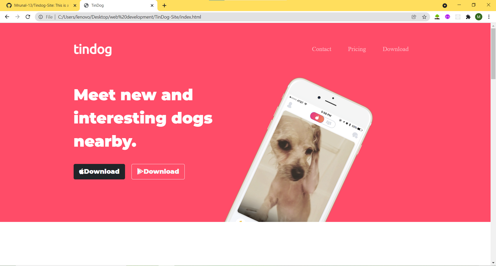
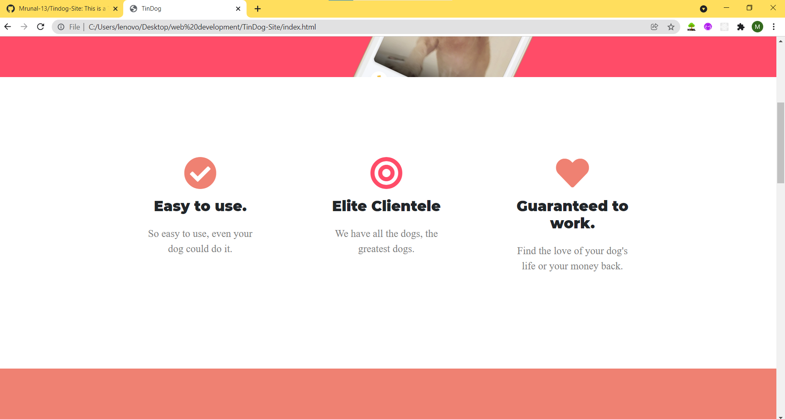
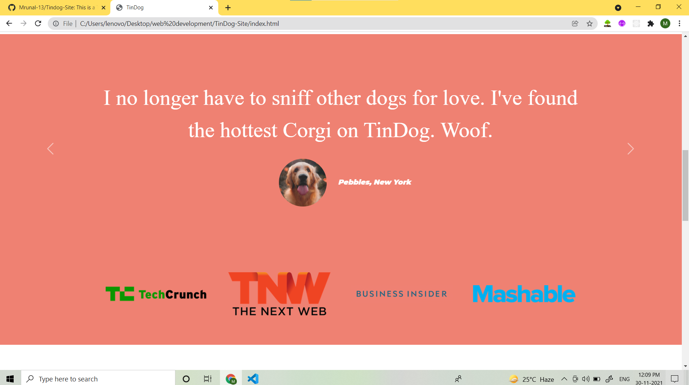
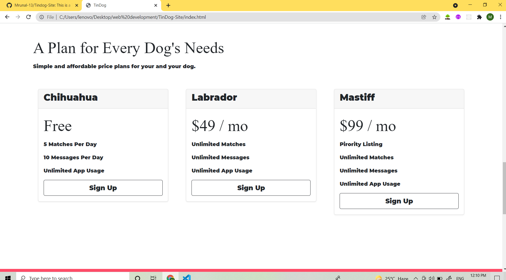
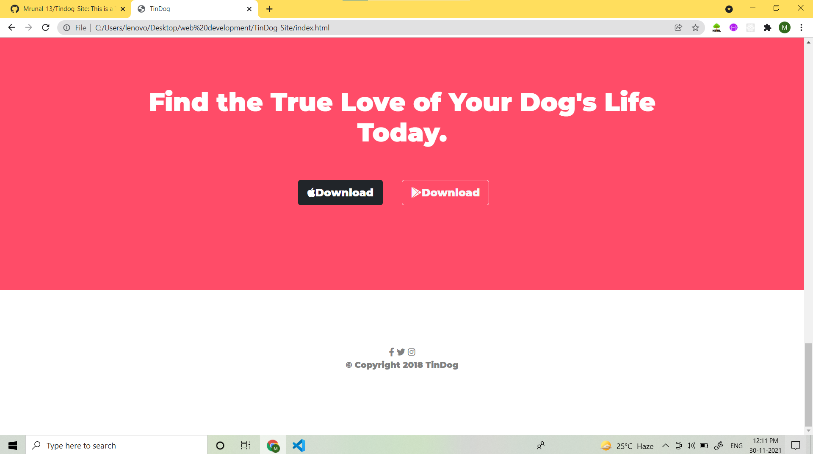

# TingDog Site 
***(link to website->https://mrunal-13.github.io/Tindog-Site/)***
## Table of contents
1)[Introduction](#Introduction)

2)[Language and enviornment](#Language-and-enviornment)

2)[Sections of website](#Sections-of-website)

3)[Resources](#Resources)

4)[Summary](#Summary)

5)[Acknowledgement](#acknowledgement)

## Introduction

TingDog Site----> This is the simple website built to showcase the use of css,html and bootstrap i have learnt till then.It was challenging to make the page look more beautiful and creative using jsut html and css.The page has not been added the functionality yet but it is about meeting new and intresting dogs here.***Find a friend for your Dog!!!***

## Languages and Environment

Languages used are:-- 1)HTML 2)CSS
environment :-- 1)vs code
File and folders: -- 1) main html file index.html 2) css folder which contains styles.css 3) Images folder which contains all jpg and png used in site

## Sections of website

1) This the first section of website i.e the upper part.
<table border="0" width="100%">
<tr>
  <td cellspacing="50%" cellpadding="50%">
    
  </td>
  <td>
The section consisit of to measure div of html that is **"Navbar" and "title"**.The Navigation bar consist of three links to sections **contact,download,pricing**.The image of dog and tagline"meet new and intresting dogs" consist of another div called **title.**It is designed in such a way using **col-lg-6 methods** of bootstrap that it shrinks and expands according to size of display device.The logos used in display button are borrowed from **favicons site and bootstrap libraries** are used to modify the buttons.
</td>
</tr>
<tr>
  <td width="500" height="400">
    
  </td>
  <td>
This  is he below section of the site telling about **features**.it is designed in features div.the icons are borowed from favicon and css styling is used for padding in all way.the font is borrowed from **google fonts monserrate and ubantu**.
</td>
</tr>
<tr>
  <td>
    
  </td>
  <td>
This image is further when we scroll down and reach our testimonials section.Special feature of bootstrap carosel is used here.the carosel is the sliding window and two arrows besides each testimonial to veiw next and previous.here we have used beautiful circle to display profile and name.
</td>
</tr>
<tr>
  <td>
    
  </td>
  <td>
This is pricing section.This format is derived from famous format of bootstrap cards.This deck od three cards and their properties allows us to style it so beautifully.
</td>
</tr>
 <tr>
  <td>
    
   </td>
   <td>
This is the footer section and contact us page using favicon icons and css styling
</td>
</tr>
</table>
  
  
  ## Resources
  
  languages used:- **html ,css**
  
  Library used BOOTSTRAP:-refrence links->>
  
  1)https://getbootstrap.com/docs/4.0/examples/ (this is bootstrap homepage)
  2)https://getbootstrap.com/docs/4.5/components/navbar/ (navigation bar bootstrap)
  3)https://getbootstrap.com/docs/4.5/components/carousel/ (carousel in bootstrap)
  
  buttons generated by:--> https://css3buttongenerator.com/
  Site for icons:-->>https://www.favicon.cc/
  
  Apple font:--> https://fontawesome.com/v5.15/icons?d=gallery&p=2&q=apple
  
  Site for google fonta:--> https://fonts.google.com/
  
  
  ## Summary
  It was website for dogs created to study css and styles.
  
  ## Acknowledgemnet
  
  I thank my udemy instructor for teaching me through css,html and bootstrap.
  
  
  
  
  
                                                                                                          @Mrunal Nimbalkar

